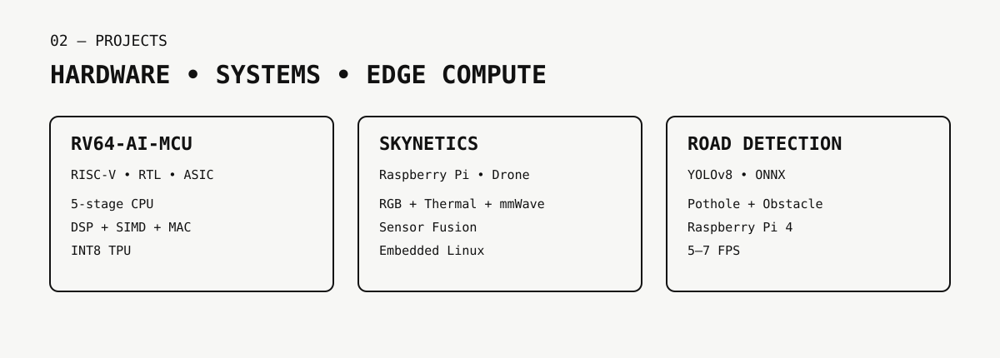
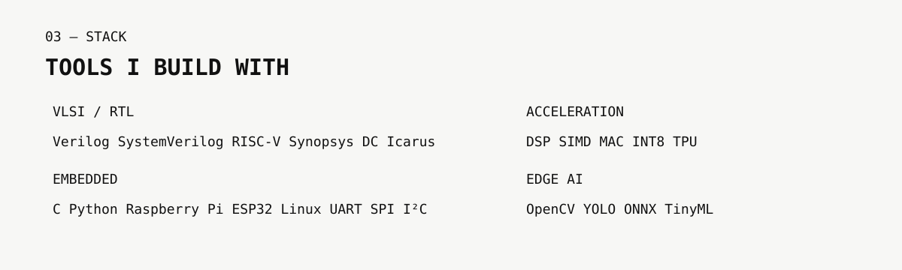

<picture>
  <source media="(prefers-color-scheme: dark)" srcset="assets/dark/header.svg">
  
</picture>

<picture><source media="(prefers-color-scheme: dark)" srcset="assets/dark/about.svg"></picture>

### `whoami`

ECE student focused on **VLSI / RTL design and embedded systems**, with hands-on work across digital design, RISC-V architecture, ASIC synthesis, Raspberry Pi, Edge AI and hardware-software integration.

Currently looking for **VLSI, RTL/ASIC, FPGA and Embedded Systems internships and entry-level opportunities**.

<picture><source media="(prefers-color-scheme: dark)" srcset="assets/dark/projects.svg"></picture>

## Featured Projects

### [RV64-AI-MCU](https://github.com/asronal/RV64-AI-MCU)
**Custom RV64 AI-oriented MCU/SoC — RTL & ASIC Design**

- RV64IMC-based 5-stage processor architecture
- DSP subsystem with SIMD and MAC acceleration
- INT8 TPU with a 16×16 systolic array
- SRAM, ROM, cache and QSPI/PSRAM interfaces
- GPIO, UART, SPI, I²C, PWM, ADC, DMA, USB and CAN FD peripherals
- Security, debug, trace and performance-monitoring blocks
- Verilog RTL, testbench, SDC constraints and Synopsys Design Compiler flow

> **Status:** Active development; RTL integration and verification are ongoing.

### [SkyNetics Rescue Drone](https://github.com/asronal/SkyNetics-RAS-drone)
**Embedded Multi-Sensor Search-and-Rescue Platform**

- Raspberry Pi 4 onboard processing
- RGB + thermal + mmWave sensing
- MLX90640 thermal array and LD2450 radar
- YOLO-based human detection
- Sensor-fusion pipeline for survivor detection
- Flight-controller telemetry and live OSD
- Embedded Linux deployment and hardware integration

### [Obstacle & Pothole Detection](https://github.com/asronal/Obstacle-and-Pothole-detection-model)
**Real-Time Edge AI on Raspberry Pi**

- YOLOv8n deployed through ONNX
- Raspberry Pi camera and USB/video/image inputs
- Real-time obstacle and pothole detection
- CPU-optimized inference reaching approximately **5–7 FPS** on Raspberry Pi 4
- Model deployment and computer-vision pipeline development

<picture><source media="(prefers-color-scheme: dark)" srcset="assets/dark/vlsi.svg"></picture>

## VLSI / Digital Design

### RTL & Computer Architecture

- Verilog / SystemVerilog
- RISC-V ISA and processor architecture
- 5-stage pipelined CPU design
- Hazard detection, forwarding and pipeline control
- Branch prediction and BTB concepts
- Memory subsystem and cache architecture
- AXI-Lite-style interconnects
- DSP, SIMD and MAC architectures
- INT8 AI accelerator / TPU architecture

### ASIC Design Flow

- RTL synthesis
- Synopsys Design Compiler
- SDC timing constraints
- Area, timing and QoR analysis
- Simulation and waveform analysis
- RTL-to-synthesis handoff preparation

### Verification

- Verilog testbenches
- Icarus Verilog
- GTKWave
- Functional simulation and debugging
- Testbench-driven RTL validation

<picture><source media="(prefers-color-scheme: dark)" srcset="assets/dark/embedded.svg"></picture>

## Embedded Systems

- Raspberry Pi 4
- ESP32 / ESP8266
- Arduino
- Embedded Linux
- Python and C
- UART, SPI, I²C, GPIO, PWM
- Camera and sensor integration
- Flight-controller communication
- Hardware/software integration
- Edge inference on resource-constrained devices

<picture><source media="(prefers-color-scheme: dark)" srcset="assets/dark/stack.svg"></picture>

## Technical Stack

**Languages**  
`C` `Python` `Verilog` `SystemVerilog`

**VLSI / Hardware**  
`RISC-V` `RTL` `ASIC` `FPGA` `Synopsys Design Compiler` `SDC`

**Verification**  
`Icarus Verilog` `GTKWave` `Testbenches`

**Embedded**  
`Raspberry Pi` `ESP32` `Arduino` `Embedded Linux`

**Edge AI**  
`OpenCV` `PyTorch` `TensorFlow` `ONNX` `YOLO` `NCNN`

<picture><source media="(prefers-color-scheme: dark)" srcset="assets/dark/current.svg"></picture>

## Current Work

- Developing a custom **RV64 AI-oriented MCU/SoC** in RTL
- Improving processor pipeline and memory-system design
- Working on DSP and hardware AI acceleration
- Learning deeper **ASIC design and physical-design concepts**
- Building embedded systems around Raspberry Pi and microcontrollers
- Exploring efficient Edge AI deployment on embedded hardware

## GitHub Activity

## Open To

- **VLSI / RTL Design internships**
- **ASIC Design internships**
- **FPGA / Digital Design internships**
- **VLSI Verification internships**
- **Embedded Systems internships**
- Embedded firmware roles
- Hardware-software integration roles
- Research opportunities in computer architecture and hardware acceleration

> **Building systems from RTL to embedded hardware.**

