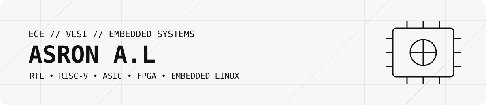
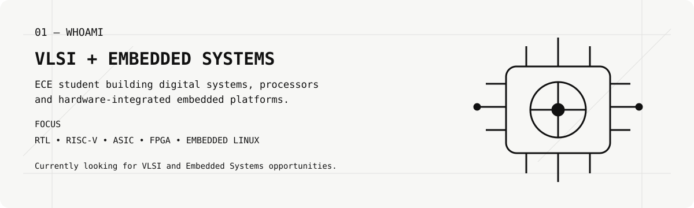
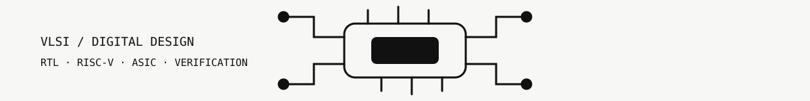

<picture>
  <source media="(prefers-color-scheme: dark)" srcset="assets/dark/header.svg">
  
</picture>

<picture>
  <source media="(prefers-color-scheme: dark)" srcset="assets/dark/about.svg">
  
</picture>

## 01 — WHOAMI

ECE student focused on **VLSI / RTL design and embedded systems**, with hands-on work across digital design, RISC-V architecture, ASIC synthesis, Raspberry Pi, Edge AI and hardware-software integration.

Currently looking for **VLSI, RTL/ASIC, FPGA and Embedded Systems internships**.

---

## 02 — FEATURED PROJECTS

<table>
<tr>
<td width="33%" valign="top">

### RV64-AI-MCU

**Custom RV64 AI-oriented MCU/SoC**

- RV64IMC 5-stage CPU
- DSP, SIMD and MAC acceleration
- INT8 TPU / 16×16 systolic array
- SRAM, ROM and cache
- QSPI/PSRAM interfaces
- GPIO, UART, SPI, I²C, PWM, ADC, DMA, USB, CAN FD
- Verilog RTL + Synopsys Design Compiler

[View repository →](https://github.com/asronal/RV64-AI-MCU)

</td>
<td width="33%" valign="top">

### SkyNetics Rescue Drone

**Embedded multi-sensor SAR platform**

- Raspberry Pi 4 onboard processing
- RGB + thermal + mmWave sensing
- MLX90640 thermal array
- LD2450 radar
- YOLO-based human detection
- Sensor fusion
- Flight-controller telemetry and OSD
- Embedded Linux deployment

[View repository →](https://github.com/asronal/SkyNetics-RAS-drone)

</td>
<td width="33%" valign="top">

### Obstacle & Pothole Detection

**Real-time Edge AI on Raspberry Pi**

- YOLOv8n + ONNX
- Raspberry Pi camera / USB / video inputs
- Obstacle and pothole detection
- CPU-optimized inference
- Approximately **5–7 FPS** on Raspberry Pi 4
- Real-time computer-vision pipeline

[View repository →](https://github.com/asronal/Obstacle-and-Pothole-detection-model)

</td>
</tr>
</table>

---

<picture>
  <source media="(prefers-color-scheme: dark)" srcset="assets/dark/vlsi.svg">
  
</picture>

## 03 — VLSI / DIGITAL DESIGN

<table>
<tr>
<td width="35%" valign="top">

### RTL & Architecture

- Verilog
- RISC-V ISA and processor architecture
- 5-stage pipelined CPU
- Hazard detection and forwarding
- Branch prediction and BTB concepts
- Cache and memory subsystem
- AXI-Lite-style interconnects
- DSP, SIMD and MAC architectures
- INT8 AI accelerator / TPU architecture

</td>
<td width="25%" valign="top">

### ASIC Flow

- RTL synthesis
- Synopsys Design Compiler
- SDC timing constraints
- Area / timing / QoR analysis
- Simulation and waveform analysis
- RTL-to-synthesis preparation

</td>
<td width="25%" valign="top">

### Verification

- Verilog testbenches
- Icarus Verilog
- GTKWave
- Functional simulation
- RTL debugging
- Testbench-driven validation

</td>
<td width="15%" valign="top">

### Tools

`Verilog`  
`RISC-V`  
`Icarus`  
`GTKWave`  
`Synopsys DC`

</td>
</tr>
</table>

---

<picture>
  <source media="(prefers-color-scheme: dark)" srcset="assets/dark/embedded.svg">
  
</picture>

## 04 — EMBEDDED SYSTEMS

<table>
<tr>
<td width="50%" valign="top">

### Platforms

- Raspberry Pi 4
- ESP32 / ESP8266
- Arduino
- Embedded Linux
- C and Python

### Interfaces

- UART
- SPI
- I²C
- GPIO
- PWM
- Camera and sensor interfaces

</td>
<td width="50%" valign="top">

### Hardware Integration

- Flight-controller communication
- GPS and sensor integration
- Thermal and mmWave sensors
- Camera pipelines
- Hardware/software integration
- Edge inference on resource-constrained devices

### Supporting Technologies

`OpenCV` `YOLO` `ONNX` `NCNN` `TensorFlow` `PyTorch`

</td>
</tr>
</table>

---

## 05 — TECHNICAL STACK

<table>
<tr>
<td width="50%" valign="top">

**Languages**  
`C` `Python` `Verilog`

**VLSI / Hardware**  
`RISC-V` `RTL` `ASIC` `FPGA` `SDC` `Synopsys Design Compiler`

</td>
<td width="50%" valign="top">

**Verification**  
`Icarus Verilog` `GTKWave` `Testbenches`

**Embedded**  
`Raspberry Pi` `ESP32` `Arduino` `Embedded Linux`

**Edge AI**  
`OpenCV` `YOLO` `ONNX` `NCNN` `TensorFlow` `PyTorch`

</td>
</tr>
</table>

## 06 — CURRENTLY WORKING ON

- **RV64-AI-MCU** — processor integration and RTL verification
- **CPU architecture** — pipeline, hazards, memory system and cache design
- **Hardware acceleration** — DSP, SIMD, MAC and INT8 AI acceleration
- **ASIC design** — synthesis, timing constraints and physical-design concepts
- **Embedded systems** — Raspberry Pi and microcontroller-based platforms
- **Edge AI** — efficient inference on resource-constrained hardware

---

## 07 — GITHUB ACTIVITY

---

## 08 — OPEN TO

<table>
<tr>
<td width="50%">

- **VLSI / RTL Design internships**
- **ASIC Design internships**
- **FPGA / Digital Design internships**
- **VLSI Verification internships**

</td>
<td width="50%">

- **Embedded Systems internships**
- Embedded firmware roles
- Hardware-software integration roles
- Research in computer architecture and hardware acceleration

</td>
</tr>
</table>

<picture>
  <source media="(prefers-color-scheme: dark)" srcset="assets/dark/current.svg">
  
</picture>

**Building systems from RTL to embedded hardware.**

